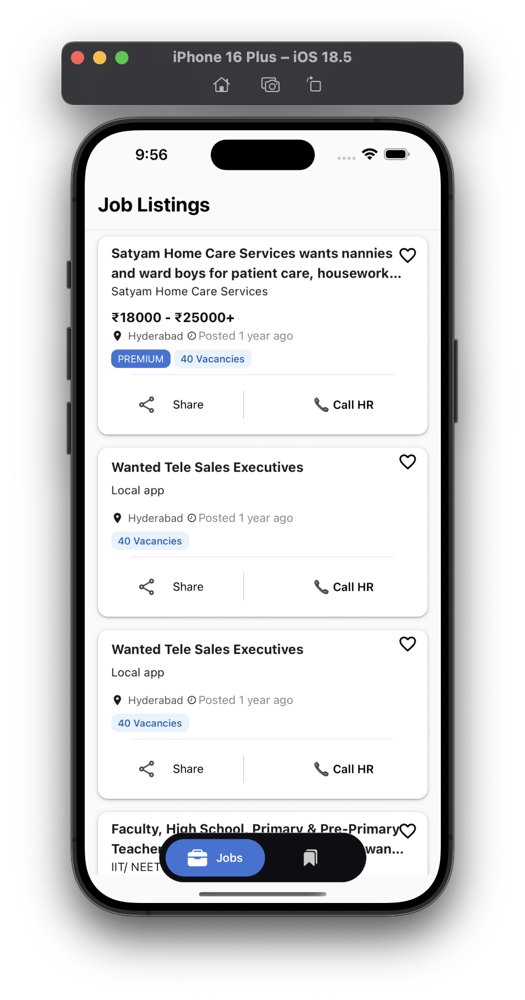
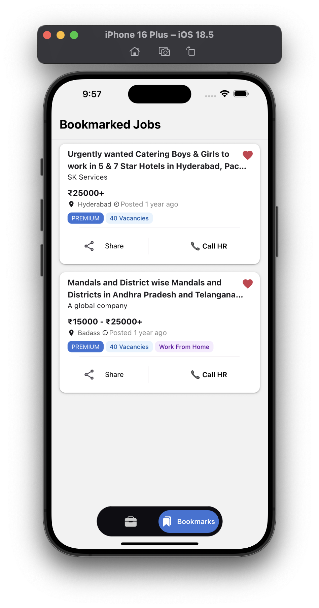
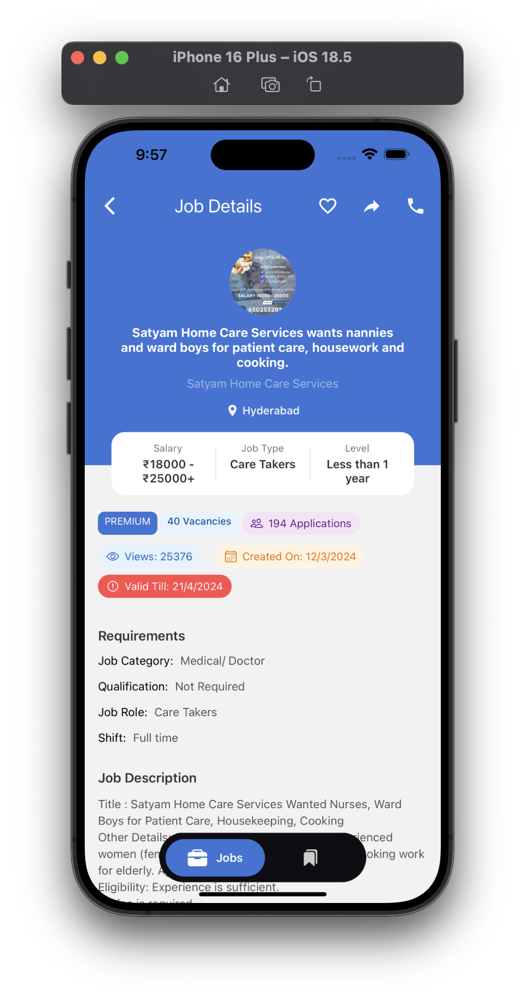
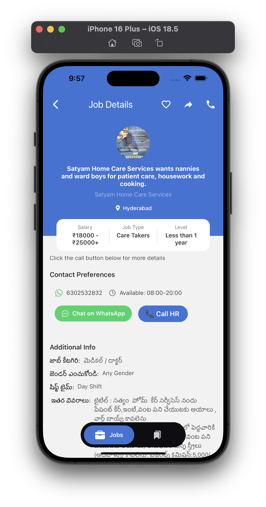

# Welcome to Job Search app 👋

This is an [Expo](https://expo.dev) project created with [`create-expo-app`](https://www.npmjs.com/package/create-expo-app).

## Project Walkthrough Video 
🎥 [Demo Walkthrough Video](https://drive.google.com/file/d/1Zof9XP4TWFGGFklOO2yka_sIsg2AwJ0E/view?usp=sharing)

## ScreenShots
### Jobs Screen 
- Browse real-time job data with smooth infinite scrolling.
- View job info: title, location, salary, and contact.
- Shows how long ago the job was posted: `3 hours ago`, `2 weeks ago`, etc.


### Bookmarks Screen
- Bookmark jobs and store them locally using AsyncStorage.
- Access saved jobs offline in a separate tab.
- Jobs remain saved even after closing the app.


### Job Detailed Screen
- View full job information on a dedicated screen.
- Initiate direct phone calls (tel links).




## Set up

1. Install dependencies

   ```bash
   npm install
   ```

2. Start the app

   ```bash
   npx expo start
   ```

In the output, you'll find options to open the app in a

- [development build](https://docs.expo.dev/develop/development-builds/introduction/)
- [Android emulator](https://docs.expo.dev/workflow/android-studio-emulator/)
- [iOS simulator](https://docs.expo.dev/workflow/ios-simulator/)
- [Expo Go](https://expo.dev/go), a limited sandbox for trying out app development with Expo

You can start developing by editing the files inside the **app** directory. This project uses [file-based routing](https://docs.expo.dev/router/introduction).


## 🧩 Libraries & Tools Used

| Library | Purpose |
|--------|---------|
| Expo | Rapid React Native development |
| **react-native-paper** | UI component library for Material Design |
| **@react-navigation/native** | Navigation and stack handling |
| **@react-navigation/bottom-tabs** | Bottom tab navigation support |
| **axios** | HTTP client to fetch job listings |
| **@react-native-async-storage/async-storage** | Store bookmarks offline |
| **React Context API** | Global state for bookmark management |  
___

